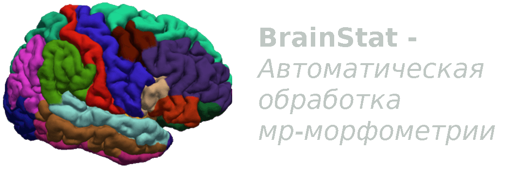

# FsWeb

*******************************************************************************

A web shell for managing calculations of MR morphometry of the brain in freesurfer.

*******************************************************************************
### Table of Contents
- [Overview](#overview)
  - [Highlights and Features](#highlights-and-features)
- [Getting Started](#getting-started)
  - [Step 1. Installation](#step-1-installation)
  - [Step 2. Preprocessing](#step-2-preprocessing)
  - [Step 3. Start](#step-3-start)
  - [Step 4. Comparing studies](#step-4-comparing-studies)
- [System requirements](#system-requirements)
- [Cite](#cite)

## Overview

### Highlights and Features
BrainStat Allows you to store/delete the results of calculating MR morphometry 
in the freesurfer program in the database.
*******************************************************************************

# Getting Started
*******************************************************************************
## Step 1 Installation

### Installing the necessary libraries
<pre>conda create -n brainstat python=3.9
conda activate brainstat
pip install -r requirements.txt</pre>

### Going to the root directory
<pre>cd ./web</pre>

### Starting a local server
<pre>python manage.py runserver</pre>

*******************************************************************************
## Step 2 Preprocessing

*******************************************************************************
## Step 3 Start

*******************************************************************************
## Step 4 Comparing studies
The web application allows you to compare two studies based on the reference 
volumes of the patient's brain.

*******************************************************************************
## System requirements 
Tested on linux operating system (Ubuntu 20.04) macos (Sequoia 15.5 with Apple M1) ;
Graphical web interface for computer processing of MR morphometry in the freesurfer 
program (version 7) and analysis of the results.

*******************************************************************************
## Cite

